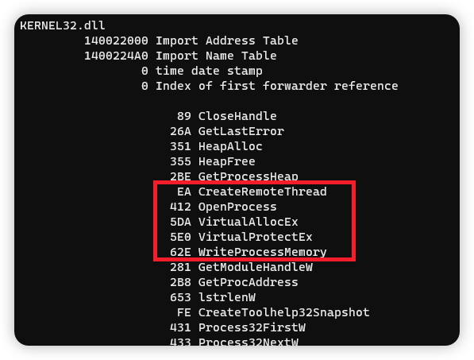

## IAT 隐藏和混淆

导入地址表 (IAT) 包含有关 PE 文件的信息，例如所使用的函数以及导出这些函数的 DLL。此类信息可用于签名和检测二进制文件。



要隐藏 IAT 中的函数，可以使用`GetProcAddress`，`GetModuleHandle`或`LoadLibrary`在运行时动态加载这些函数。

```c++
fnVirtualAllocEx pVirtualAllocEx = GetProcAddress(GetModuleHandleA("KERNEL32.DLL"), "VirtualAllocEx");
```

但是使用此方法存在的问题是，`VirtualAllocEx`字符串仍存在于二进制文件中，可以用来检测函数的使用情况。并且`GetProcAddress`并将`GetModuleHandleA`出现在 IAT 中。

所以我们可以创建执行`GetProcAddress`与`GetModuleHandle` WinAPI 相同操作的自定义函数。这样就可以动态加载函数，而无需让这两个函数出现在 IAT 中。

### 自定义GetProcAddress

先来看一下 `GetProcAddress`的函数功能， `GetProcAddress`从指定的模块句柄中检索导出函数的地址。如果在指定的模块句柄中找不到函数名称，则该函数返回`NULL`。

https://learn.microsoft.com/en-us/windows/win32/api/libloaderapi/nf-libloaderapi-getprocaddress

```c
FARPROC GetProcAddress(
  [in] HMODULE hModule,
  [in] LPCSTR  lpProcName
);
```


#### GetProcAddress 的工作原理


首先我们必须解决的第一点是`GetProcAddress`如何找到并检索函数的地址。

`hModule`参数是已加载 DLL 的基地址。这是 DLL 模块在进程地址空间中的位置。考虑到这一点，检索函数地址的方法是通过循环遍历提供的 DLL 中的导出函数并检查目标函数的名称是否存在。如果存在有效匹配，则检索地址。要访问导出的函数，必须访问 DLL 的导出表并循环遍历它以搜索目标函数名称。


### API Hash

