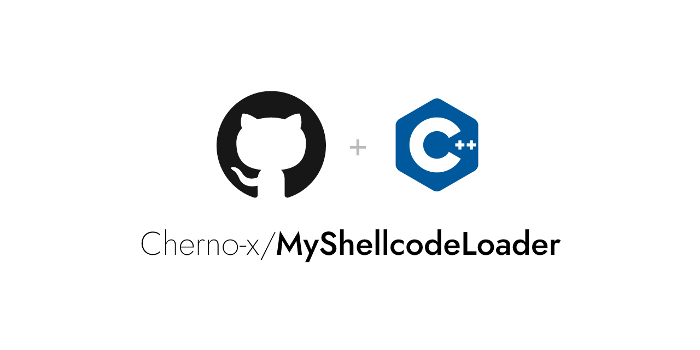

# MyShellcodeLoader

这个Github仓库包含Shellcode Loader的实现原理以及其在恶意软件开发和木马免杀方面的应用。

Shellcode Loader是一种常见的技术，用于将恶意代码加载到目标系统的内存中，并执行它们，通常作为恶意软件的一部分。

通过这个仓库，可以学习恶意软件开发和木马免杀的相关知识。

持续更新中～

（本人懒得搞博客，都发github上）

### **Key Features:**

- 提供了不同shellcode loader的代码示例。
- 在各个文件夹readme.md中讲述了对应手法的实现原理。
- 会在不同技术中穿插杀软的检测原理并讲述绕过手法。

### Instructions for Use:

1. 克隆本仓库到本地环境。
2. 探索不同的示例代码和文档，了解Shellcode Loader的工作原理和实现方法。
3. 学习如何应用Shellcode Loader技术在恶意软件开发中，以及如何免杀木马程序。

我们鼓励安全研究者、渗透测试人员和安全工程师共同参与这个仓库的探讨和贡献。通过深入了解Shellcode Loader，我们可以更好地理解和应对当前的安全威胁，并提高系统的安全性。

#### Study Roadmap：

详情请见 0x00 Study Roadmap/README.MD

# ⚠️ Warning

**免责声明:** 请注意，本仓库仅用于学习和研究目的。在使用任何与恶意软件开发相关的技术时，请遵守当地法律法规，不要进行任何违法活动。对于任何不当使用造成的后果，本仓库的维护者不承担任何责任。

欢迎提出建议、报告漏洞或贡献代码以改进本仓库的内容。让我们共同努力，提高网络安全意识和技术水平！

